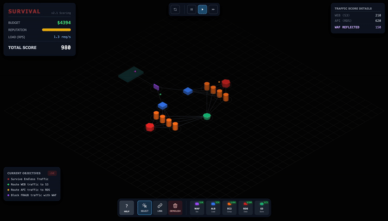

# Server Survival

**Server Survival** is an interactive 3D simulation game where you play as a **Cloud Architect**. Your mission is to build and scale a resilient cloud infrastructure to handle increasing traffic loads while fighting off DDoS attacks, managing your budget, and keeping your services healthy.

Learn cloud by playing:

## How to Play

### Objective

Survive as long as possible! Manage your **Budget ($)**, **Reputation (%)**, and **Service Health**.

- **Earn Money** by successfully processing legitimate traffic requests.
- **Lose Reputation** if requests fail or if malicious traffic slips through.
- **Maintain Health** - Services degrade under load and need repairs.
- **Game Over** if Reputation hits 0% or you go bankrupt ($-1000).

### Traffic Types

| Traffic       | Color  | Destination        | Reward | Description                            |
| :------------ | :----- | :----------------- | :----- | :------------------------------------- |
| **STATIC**    | Green  | CDN / Storage      | $0.50  | Static file requests (images, CSS, JS) |
| **READ**      | Blue   | Replica / NoSQL / SQL DB | $0.80  | Database read operations               |
| **WRITE**     | Orange | NoSQL / SQL DB     | $1.20  | Database write operations              |
| **UPLOAD**    | Yellow | Storage            | $1.50  | File uploads                           |
| **SEARCH**    | Cyan   | Search Engine / SQL DB | $1.20  | Search queries (Search Engine preferred, SQL DB fallback) |
| **MALICIOUS** | Red    | Blocked by Firewall| $0     | DDoS attacks — block with Firewall!    |

### Infrastructure & Services

Build your architecture using the toolbar. Each service has a cost, capacity, and upkeep:

| Service          | Cost | Capacity  | Upkeep    | Function                                                              |
| :--------------- | :--- | :-------- | :-------- | :-------------------------------------------------------------------- |
| **Firewall**     | $40  | 30        | Low       | **Security.** First line of defense. Blocks malicious traffic.        |
| **API Gateway**  | $70  | 40        | Medium    | **Rate Limiting.** Throttles excess traffic (soft-fail). **Upgradeable T1→T3.** |
| **Queue**        | $45  | Queue:200 | Low       | **Buffer.** Buffers requests during spikes. Prevents drops.           |
| **Load Balancer**| $50  | 20        | Medium    | **Distribution.** Distributes traffic to multiple instances.          |
| **Compute**      | $60  | 4         | High      | **Processing.** Processes requests. **Upgradeable T1→T3.**            |
| **Serverless Function** | $45 | 30 (auto) | Very Low + $0.03/req | **Pay-per-use Compute.** Auto-scales with traffic. Low upkeep, but charges $0.03 per request. Cheap when idle, expensive at high RPS. |
| **CDN**          | $60  | 50        | Low       | **Delivery.** Caches STATIC content at edge (95% hit rate).           |
| **SQL DB**       | $150 | 8         | Very High | **Database.** Handles READ/WRITE/SEARCH. **Upgradeable T1→T3.**      |
| **NoSQL DB**     | $80  | 15        | High      | **Fast Database.** Handles READ/WRITE only (no SEARCH). **Upgradeable T1→T3.** |
| **Cache**        | $60  | 30        | Medium    | **Caching.** Caches responses to reduce DB load. **Upgradeable T1→T3.** |
| **Search Engine**| $120 | 12        | High      | **Search.** Specialized for SEARCH queries. 3x faster than SQL DB. **Upgradeable T1→T3.** |
| **Read Replica** | $100 | 12        | Medium    | **Read Offload.** Offloads READ from master DB. Requires DB connection. **Upgradeable T1→T3.** |
| **Storage**      | $25  | 25        | Low       | **File System.** Destination for STATIC/UPLOAD traffic.               |

### Scoring & Economy

| Action         | Money  | Score | Reputation |
| :------------- | :----- | :---- | :--------- |
| Static Request | +$0.50 | +3    | +0.1       |
| DB Read        | +$0.80 | +5    | +0.1       |
| DB Write       | +$1.20 | +8    | +0.1       |
| File Upload    | +$1.50 | +10   | +0.1       |
| Search Query   | +$1.20 | +5    | +0.1       |
| Attack Blocked | +$0.50 | +10   | -          |
| Request Failed | -      | -half | -1         |
| Req. Throttled | -      | -     | -0.2       |
| Attack Leaked  | -      | -     | -5         |

### Upkeep & Cost Scaling

- **Base Upkeep:** Each service has per-minute upkeep costs
- **Upkeep Scaling:** Costs increase 1x to 2x over 10 minutes
- **Repair Costs:** 15% of service cost to manually repair
- **Auto-Repair:** +10% upkeep overhead when enabled

### Game Modes

#### Survival Mode

The core experience - survive as long as possible against escalating traffic with constant intervention required:

**Dynamic Challenges:**

- **RPS Acceleration** - Traffic multiplies at time milestones (×1.3 at 1min → ×4.0 at 10min)
- **Random Events** - Cost spikes, capacity drops, traffic bursts every 15-45 seconds
- **Traffic Shifts** - Traffic patterns change every 40 seconds
- **DDoS Spikes** - 50% malicious traffic waves every 45 seconds
- **Service Degradation** - Services lose health under load, require repairs

**New UI Features:**

- **Health bars on all services**
- **Active event indicator bar at top**
- **Detailed finances panel (income/expenses breakdown)**
- **Service health panel with repair costs**
- **Auto-repair toggle**
- **Game over analysis with tips**

#### Sandbox Mode

A fully customizable testing environment for experimenting with any architecture:

| Control           | Description                                                       |
| :---------------- | :---------------------------------------------------------------- |
| **Budget**        | Set any starting budget (slider 0-10K, or type any amount)        |
| **RPS**           | Control traffic rate (0 = stopped, or type 100+ for stress tests) |
| **Traffic Mix**   | Adjust all 6 traffic type percentages independently               |
| **Burst**         | Spawn instant bursts of specific traffic types                    |
| **Upkeep Toggle** | Enable/disable service costs                                      |
| **Clear All**     | Reset all services and restore budget                             |

**No game over in Sandbox** - experiment freely!

### Recent Features (v2.3)

- **Serverless Function** - Pay-per-use compute variant ($45 to place, $2/min upkeep, $0.03 per completed request). Auto-scales to capacity 30 with a 900ms cold-start processing time. Same routing topology as Compute (ALB/Queue/API Gateway upstream; Cache/DB/NoSQL/S3/Search/Replica downstream).
- **Cost-aware Smart Hint** - Warns when a Serverless node's per-request cost is adding up at high RPS, nudging players toward a Compute node for sustained throughput.

### Recent Features (v2.2)

- **Search Engine** - Specialized SEARCH handler, 3x faster than SQL DB (100ms vs 300ms). Upgradeable (Tiers 1-3: 12/25/40 capacity)
- **Read Replica** - Offloads READ traffic from master DB. Requires connection to SQL DB or NoSQL. Upgradeable (Tiers 1-3)
- **Smart Hints** - Contextual suggestions when your architecture is suboptimal (e.g. "DB overloaded with SEARCH — add a Search Engine!")
- **Economy Rebalance** - Starting budget $500, SEARCH reward increased to $1.20
- **New Traffic Shifts** - "Read Heavy" (45% READ) and "Full-Text Flood" (55% SEARCH) patterns

### Previous Features (v2.1)

- **API Gateway** - Rate limits traffic with soft-fail throttling (-0.2 rep instead of -1.0). Upgradeable (Tiers 1-3: 20/40/80 RPS)
- **NoSQL Database** - Fast alternative to SQL for READ/WRITE traffic (150ms vs 300ms). Cannot handle SEARCH. Upgradeable (Tiers 1-3)
- **Constant Intervention Mechanics** - Game requires active management throughout
- **Service Health System** - Visual health bars, manual/auto repair options
- **RPS Milestones** - Traffic surge warnings with multiplier display
- **Active Event Bar** - Shows current random event with countdown timer
- **Detailed Finances** - Income by request type, expenses by service with counts
- **Game Over Analysis** - Failure reason, description, and contextual tips
- **Retry Same Setup** - Restart with same architecture after game over
- **Interactive Tutorial** - Guided walkthrough for new players

### Controls

- **Left Click:** Select tools, place services, and connect nodes.
- **Right Click + Drag:** Pan the camera.
- **Scroll:** Zoom in and out.
- **WASD / Arrows:** Move camera (pan) when zoomed in.
- **ESC:** Open main menu and pause game. Press again or click Resume to close menu (stays paused).
- **Camera Reset:** Press `R` to reset the camera position.
- **Birds-Eye View:** Press `T` to switch between isometric and top-down view.
- **Hide HUD:** Press `H` to toggle UI panels.
- **Connect Tool:** Click two nodes to create a connection (flow direction matters!).
  - _Valid Flows:_ Internet -> (Firewall/CDN/API Gateway) -> Load Balancer -> Queue -> Compute -> Cache -> (Search Engine/Read Replica/SQL DB/NoSQL DB/Storage)
- **Delete Tool:** Remove services to recover 50% of the cost.
- **Time Controls:** Pause, Play (1x), and Fast Forward (3x).

## Strategy Tips

1.  **Block Attacks First:** Always place a Firewall immediately connected to the Internet. Malicious leaks destroy reputation fast (-5 per leak).
2.  **Use CDN for Static Content:** Connect Internet -> CDN -> Storage. The CDN handles 95% of static traffic cheaply!
3.  **Watch Service Health:** Damaged services have reduced capacity. Click to repair or enable Auto-Repair.
4.  **Scale for Traffic Surges:** RPS multiplies at milestones - prepare before ×2.0 at 3 minutes!
5.  **Balance Income vs Upkeep:** Start lean, scale as income grows. Over-provisioning leads to bankruptcy.
6.  **Use Cache Wisely:** Reduces database load significantly for READ requests.
7.  **Buffer with Queue:** Queue helps survive traffic burst events without dropping requests.
8.  **React to Events:** Watch the event bar - cost spikes mean hold off on purchases, traffic bursts mean ensure capacity.
9.  **API Gateway for Graceful Degradation:** Throttled requests only lose -0.2 reputation (vs -1.0 for failures). Great for surviving traffic spikes!
10. **Split DB Traffic with NoSQL:** Route READ/WRITE to NoSQL (faster, cheaper) and keep SQL DB for SEARCH queries only.
11. **Search Engine for SEARCH Storms:** SEARCH is the heaviest traffic type (2.5x weight). A dedicated Search Engine processes it 3x faster than SQL DB.
12. **Read Replica for READ offloading:** Under "API Heavy" or "Read Heavy" shifts, a Read Replica prevents your main DB from drowning in READ requests.
13. **Serverless Function = pay-per-use:** Great for spiky traffic, but monitor finances — per-request cost ($0.03) adds up fast at high RPS.

## Tech Stack

- **Core:** Vanilla JavaScript (ES6+)
- **Rendering:** [Three.js](https://threejs.org/) for 3D visualization.
- **Styling:** [Tailwind CSS](https://tailwindcss.com/) for the glassmorphism UI.
- **Build:** No build step required! Just standard HTML/CSS/JS.

## Getting Started

1.  Clone the repository.
2.  Open `index.html` in your modern web browser.
3.  Start building your cloud empire!

## Community

Join our Discord server to discuss strategies and share your high scores:
[Join Discord](https://discord.gg/f38NgHDwnK)

---

_Built with code and chaos._
